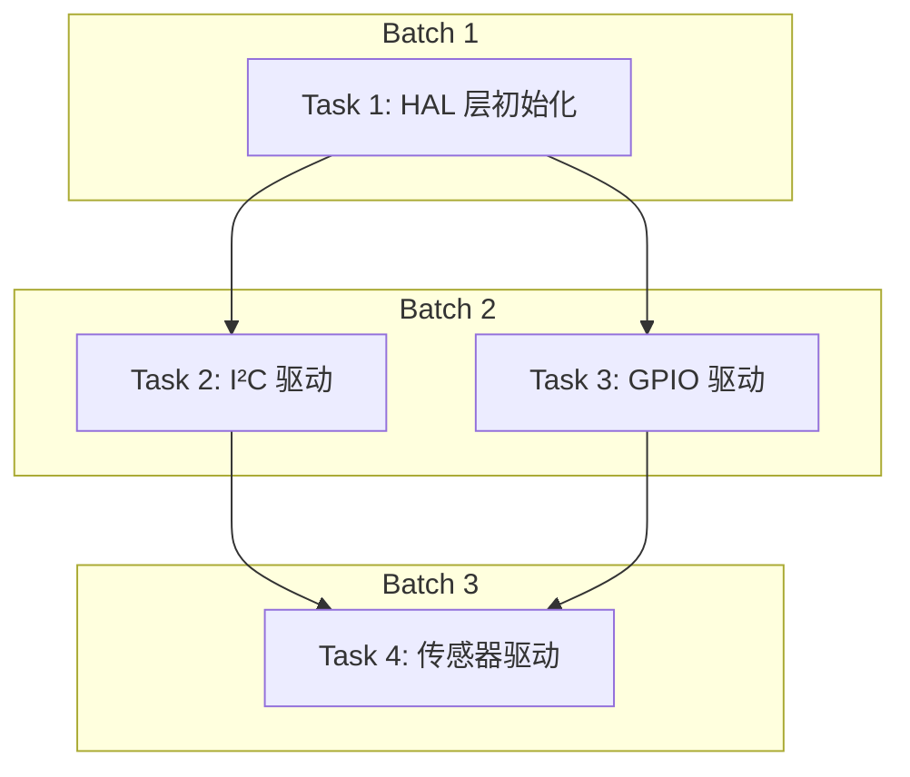

# Agent 编排层设计

> 五层 Agent 系统的第二层。调度 + 质量管控，按依赖批次交付。

## 职责

**输入**: PRD + 4 张施工清单 + Issue 清单（从需求对齐层接收）
**输出**: 按依赖批次交付的完成结果（经 AI 审查 + 你验证 + 验收清单通过）

**本层不直接写代码，负责任务调度、Agent 管理、质量审查。**

---

## 整体流程

```
需求对齐层输出施工包
    │
    ▼
┌──────────────────────────────────────┐
│  Step 1: 解析施工包                   │
│  读取施工名单 + Issue 清单            │
│  构建任务依赖图                       │
│  产出：带依赖关系的 DAG               │
└──────────────┬───────────────────────┘
               │
               ▼
┌──────────────────────────────────────┐
│  Step 2: 分批派发                     │
│  按依赖图分组：                       │
│  Batch 1 → 无依赖的任务（并行）       │
│  Batch 2 → 依赖 Batch 1 的任务（并行） │
│  Batch N → 依赖 Batch N-1 的任务      │
│  产出：有序的任务批次                  │
└──────────────┬───────────────────────┘
               │
               ▼
    ┌─────────────────────┐
    │  当前批次：派发 Agent  │
    │  每个任务→独立 Agent   │
    │  分配工具 + skills     │
    └──────────┬──────────┘
               │
               ▼
    ┌─────────────────────┐
    │  Agent 执行          │
    │  使用 tdd 等 skills   │
    │  完成任务 + 提交       │
    └──────────┬──────────┘
               │
       ┌───────┴───────┐
       │               │
       ▼               ▼
    ┌────────┐   ┌──────────┐
    │ 成功    │   │ 失败      │
    └───┬────┘   │ 第1次?    │
        │        ├─ 是→重试  │
        │        └─ 否→标记  │
        │          停止+报警  │
        ▼               │
    ┌──────────┐        ▼
    │ AI 审查   │    你决断
    │ review   │
    │ skill    │
    └───┬──────┘
        │
    ┌───┴────────┐
    │ 审查通过?    │
    ├─ 是→你验证  │
    └─ 否→打回重做 │
              │
              ▼
    ┌────────────────┐
    │ 验收清单确认     │
    │ 所有项通过=完成  │
    └───────┬────────┘
            │
            ▼
    ┌─────────────────────┐
    │ 交付当前批次给你     │
    │ 你 review 后确认     │
    │ → 启动下一批次       │
    └─────────────────────┘
```

---

## Step 1: 解析施工包 — 依赖图构建

### 输入解析

| 施工清单项 | 映射为 |
|-----------|--------|
| 文件施工名单 -> 新增文件 A | Task A |
| 文件施工名单 -> 修改文件 B | Task B |
| Issue 清单 -> Issue 1 | Task 1（含多文件操作） |

### 依赖关系推导规则

```
规则 1：文件级别依赖
  Task A 输出文件 X → Task B 需要文件 X 作为输入
  → A 是 B 的前置依赖

规则 2：接口级别依赖
  Task A 定义接口 I → Task B 实现接口 I
  → A 是 B 的前置依赖

规则 3：数据级别依赖
  Task A 产生数据结构 D → Task B 消费数据结构 D
  → A 是 B 的前置依赖

规则 4：无依赖
  Task A 和 Task B 操作不同文件、无共享接口和数据
  → A 和 B 可以并行
```

### 依赖图输出格式



### 批次生成逻辑

| Batch | 包含的任务 | 调度方式 |
|:-----:|-----------|:--------:|
| 1 | 无任何依赖的任务 | 并行 |
| 2 | 仅依赖 Batch 1 的任务 | 并行 |
| N | 仅依赖 Batch N-1 的任务 | 并行 |

---

## Step 2: 派发 Agent

### Agent 分配

| 任务属性 | Agent 分配策略 |
|---------|---------------|
| 文件操作类（增/删/改文件） | 通用执行 Agent |
| 测试类 | 专用测试 Agent |
| 嵌入式驱动类 | 关联对应 skill 的 Agent（adc-module、i2c-bus 等） |
| 构建/烧录类 | 关联对应工具 skill 的 Agent |
| Review 类 | 审查专用 Agent |

### 工具分配

每个 Agent 创建时携带：

- **任务描述** — 来自施工清单（精确到文件路径 + 操作 + 预期结果）
- **关联 skills** — 根据 SKILL_REGISTRY.md 匹配的嵌入式技能
- **验收标准** — 对应验收测试清单中的条目
- **资源限制** — 参考 AGENTS.md 中的资源限制（超时 300s、并发 4 等）

---

## Step 3: 执行与重试

### 执行状态机

```
INIT → RUNNING → SUCCESS → AI_REVIEW → USER_VERIFY → DONE
                    → FAILED (第1次) → RETRY → RUNNING
                    → FAILED (第2次) → STOPPED → 报警
```

### 重试策略

| 条件 | 行为 |
|------|------|
| 第 1 次失败 | 自动重试，记录失败原因到日志 |
| 第 2 次失败 | **停止该任务**，标记为 FAILED，输出报警信息 |
| 超时（300s） | 等同第 1 次失败，自动重试 |
| 连续超时 2 次 | 等同第 2 次失败，停止 + 报警 |

### 报警信息格式

```markdown
## 任务失败报告

**任务**: [Task 名称]
**批次**: Batch N
**尝试次数**: 2（均失败）

**失败原因**: [具体错误描述]
**错误日志**: [关键错误输出]

**影响范围**:
- 阻塞的任务: [依赖此任务的 Task 列表]
- 本批次状态: 暂停（等你决断）

**建议操作**:
- A) 修复后重试该任务
- B) 跳过该任务（手动处理）
- C) 回退到需求对齐层重新讨论
```

---

## Step 4: 质量管控 — 三层门禁

### 第 1 层：AI 自动审查

Agent 任务完成后，编排层自动调 review skill：

| 审查项 | 方法 | 通过条件 |
|--------|------|----------|
| 代码正确性 | review skill 执行 | 无功能性错误 |
| 规范一致性 | 对照 AGENTS.md 编码规范 | 无违规 |
| 变更范围 | 对比施工名单的操作 | 没有额外文件被修改 |
| 验收测试清单 | 验证 Agent 的自测结果 | 清单通过或注明原因 |

**审查不通过 → 打回 Agent 重做**，不消耗你的时间。

### 第 2 层：你验证

AI 审查通过后，编排层将结果交付给你：

- 展示变更摘要（改了什么文件、改了什么内容）
- 提供 git diff 链接
- 标注审查结果

你确认后进入第 3 层。

### 第 3 层：验收测试清单确认

你验证通过后，编排层对照施工清单中的验收测试清单逐项确认：

| 验收项 | 状态 | 证据 |
|--------|:----:|------|
| 功能正确性 | ✅ 通过 | Agent 测试结果 + AI 审查通过 |
| 行为不变 | ✅ 通过 | git diff 范围符合预期 |
| 文档同步 | ✅ 通过 | 引用路径可访问 |
| 构建通过 | ✅ 通过 | 构建输出 exit 0 |
| **全部通过** | **✅** | **本批次完成** |

---

## 层间接口

### 输入（从需求对齐层）

```json
{
  "prd": "path/to/prd.md",
  "checklists": {
    "status": [/* 现状确认表 */],
    "constraints": [/* 代码约束清单 */],
    "files": [/* 文件施工名单 */],
    "acceptance": [/* 验收测试清单 */]
  },
  "issues": [/* Issue 清单 */]
}
```

### 输出（交付给你）

```json
{
  "batch": 1,
  "total_batches": 3,
  "tasks": [
    {
      "id": "T1",
      "name": "HAL 层初始化",
      "status": "DONE",
      "files_changed": ["drivers/hal/init.c"],
      "review_result": "PASS",
      "acceptance_result": "ALL_PASS",
      "commit": "abc123def"
    }
  ],
  "blocked_tasks": [],
  "failed_tasks": []
}
```

---

## 质量门禁汇总

| 门禁点 | 通过条件 |
|--------|----------|
| Step 1 → Step 2 | 依赖图构建完成，无循环依赖 |
| Step 2 → Step 3 | Agent 分配完成，工具链就绪 |
| Step 3 → Step 4 | Agent 任务完成 + 提交 |
| 第 1 层：AI 审查 | review skill 通过 |
| 第 2 层：你验证 | 你确认变更 |
| 第 3 层：验收清单 | 所有验收项通过 |
| 批次完成 → 下一批次 | 你确认批次结果 |

## 使用的 Skills

| 用途 | Skill |
|------|-------|
| 任务执行 | tdd（主）、prototype、diagnose（按需） |
| 审查 | review |
| 交接 | handoff |
